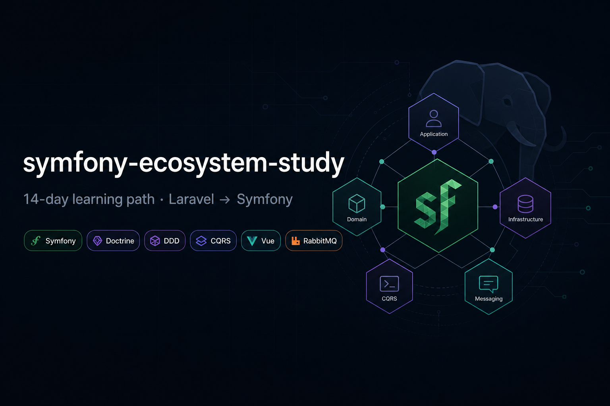

# symfony-ecosystem-study

Osobní poznámky a cvičení — přechod z Laravelu na Symfony stack.  
Cíl: za ~14 dní pochopit, jak tenhle ekosystém funguje v praxi (ne memorovat docs).

Laravel a PHP znám, tady si mapuju, co je co jinde.

---

## Co mě zajímá / co potřebuju umět

| Oblast | Co to je |
|--------|----------|
| Symfony | framework místo Laravelu |
| Doctrine | ORM (Eloquent ekvivalent) |
| DDD | organizace kódu podle domény |
| CQRS | oddělení zápisu a čtení |
| Messenger + RabbitMQ | fronty / async (jako Laravel queues) |
| Vue + TS + Vite | frontend |
| JWT | API auth |
| PHPStan, Mago | statická analýza |
| DI, Console | service container, vlastní příkazy |

Hlavní zdroje:
- https://symfonycasts.com/
- https://refactoring.guru/design-patterns
- https://mago.carthage.software/latest/en/

---

## Laravel → Symfony (pro mě)

| Laravel | Symfony |
|---------|---------|
| Eloquent | Doctrine |
| Artisan | Console (`bin/console`) |
| Service container | DI / `services.yaml` |
| `routes/web.php` | routes (attributes / yaml) |
| Blade | Twig |
| Middleware | event listeners |
| Queues | Messenger + RabbitMQ |
| Vite | Vite / Webpack Encore |
| Sanctum | JWT + Security |

---

## Plán — 14 dní (~3–4 h/den)

### Týden 1

**Den 1 — Symfony základy**
- [x] nainstalovat Symfony CLI, vytvořit webapp
- [x] porovnat strukturu s Laravel (`src/` vs `app/`)
- [x] routing, controller, Twig

Odkazy:
- https://symfonycasts.com/screencast/symfony
- https://symfony.com/doc/current/setup.html

**Den 2 — konfigurace, services**
- [ ] services, autowiring, `.env`
- [ ] bundles, config

- https://symfony.com/doc/current/configuration.html

**Den 3 — Dependency Injection**
- [ ] `services.yaml`, interface → implementace
- [ ] tagy (základně)
- [ ] porovnat s `AppServiceProvider` v Laravelu

- https://symfonycasts.com/screencast/symfony/services
- https://symfony.com/doc/current/service_container.html
- https://refactoring.guru/design-patterns/dependency-injection

**Den 4 — Doctrine**
- [ ] entity, repository, migrace
- [ ] vztahy (OneToMany, ManyToMany)
- [ ] `persist()` + `flush()` — jiný mindset než Eloquent

- https://symfonycasts.com/screencast/symfony/doctrine
- https://symfony.com/doc/current/doctrine.html
- https://refactoring.guru/design-patterns/repository

**Den 5 — Console**
- [ ] vlastní command `app:hello`
- [ ] argumenty, options, DI v commandu

- https://symfonycasts.com/screencast/symfony/console-command
- https://refactoring.guru/design-patterns/command

**Den 6 — design patterns**
- [ ] projít: Strategy, Factory, Repository, Observer, Decorator, Command
- [ ] najít kde se to v Symfony reálně používá

- https://refactoring.guru/design-patterns
- https://refactoring.guru/design-patterns/php

**Den 7 — DDD + CQRS**
- [ ] Entity, Value Object, Aggregate (teorie)
- [ ] Command vs Query
- [ ] Messenger jako transport
- [ ] zkusit: `CreateUserCommand` + `GetUserQuery`

- https://martinfowler.com/bliki/CQRS.html
- https://symfonycasts.com/screencast/messenger
- https://symfony.com/doc/current/messenger.html

### Týden 2

**Den 8 — Vue + TypeScript**
- [ ] Composition API (`ref`, `computed`)
- [ ] komponenty, props
- [ ] typy u API response

- https://vuejs.org/guide/introduction.html
- https://www.typescriptlang.org/docs/handbook/intro.html

**Den 9 — Vite / Webpack v Symfony**
- [ ] build pipeline `assets/` → `public/build/`
- [ ] rozdíl Vite vs Webpack Encore

- https://vite.dev/guide/
- https://symfony.com/doc/current/frontend.html

**Den 10 — RabbitMQ**
- [ ] co je broker, queue, exchange
- [ ] Message → Handler → transport
- [ ] analogie k Laravel Jobs

- https://www.rabbitmq.com/tutorials
- https://symfony.com/doc/current/messenger.html#amqp-transport

**Den 11 — JWT + Security**
- [ ] firewall, authenticator
- [ ] login → token → API request

- https://symfony.com/doc/current/security.html
- https://github.com/lexik/LexikJWTAuthenticationBundle

**Den 12 — PHPStan, Mago, CI**
- [ ] spustit PHPStan, opravit typy
- [ ] `mago init`, `mago analyze`
- [ ] základní CI pipeline

- https://phpstan.org/user-guide/getting-started
- https://mago.carthage.software/latest/en/

**Den 13 — SASS / LESS**
- [ ] proměnné, nesting, mixiny
- [ ] napojit do Vite

- https://sass-lang.com/documentation/

**Den 14 — demo**
- [ ] malá appka: API + Doctrine + JWT
- [ ] CQRS přes Messenger
- [ ] Vue frontend
- [ ] jeden console command
- [ ] PHPStan/Mago v CI

---

## Priorita (když nestíhám)

1. Symfony + DI + Doctrine
2. DDD/CQRS základy
3. Vue + TS + Vite
4. RabbitMQ / Messenger
5. PHPStan, Mago, CI
6. zbytek

---

## Struktura repa

```
demo/        — Symfony aplikace
docs/        — studijní deník (den 1, den 2, …)
private/     — jen lokálně, ne na git (.gitignore)
```

Studijní poznámky: [docs/README.md](docs/README.md)

---

## Progress

| den | téma | hotovo | poznámka |
|-----|------|--------|----------|
| 1 | Symfony základy | x | [den-01](docs/den-01.md) |
| 2 | konfigurace | | |
| 3 | DI | | |
| 4 | Doctrine | | |
| 5 | Console | | |
| 6 | patterns | | |
| 7 | DDD + CQRS | | |
| 8 | Vue + TS | | |
| 9 | Vite | | |
| 10 | RabbitMQ | | |
| 11 | JWT | | |
| 12 | PHPStan + Mago | | |
| 13 | SASS | | |
| 14 | demo | | |

---

## Užitečné odkazy (sbírka)

**Symfony**
- https://symfonycasts.com/
- https://symfony.com/doc/current/index.html
- https://symfony.com/doc/current/best_practices.html

**Architektura**
- https://refactoring.guru/design-patterns
- https://martinfowler.com/bliki/CQRS.html

**Frontend**
- https://vuejs.org/
- https://vite.dev/

**Nástroje**
- https://phpstan.org/
- https://mago.carthage.software/latest/en/
- https://www.rabbitmq.com/tutorials
